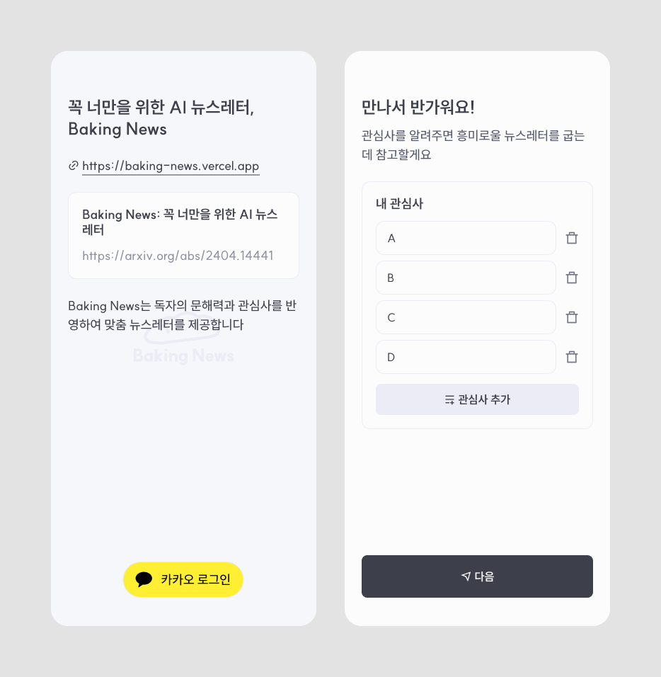

# 2024년 되돌아보기
## 들어가며..
현역병 신분이였기에 활동과 자유에 큰 제약이 있었고, 나는 그 안에서 내가 할 수 있는 최선을 다 했다. 힘들지 않다고는 말할 수 없을 것 같다. 누가 군대에 있고 싶어서 있겠어요. 현역병에게는 병영생활과 영내대기의 의무가 있는 한에는 행복하기 어려울것이라 생각한다. 올해의 다짐으로 삼았던 문장은 "그럼에도 불구하고 성장하기"였는데, 잘 따른 것 같다.
힘든 해였다. 너무나도 힘들어서 심리상담도 많이 받았고, 많이 심적으로 흔들리기도 했다. 그래도 항상 곁에 있어준 사람들 덕에 큰 위안을 받았다. 부서 사람들도, 생활관 사람들에게도, 항상 고마웠다. 내가 사람복이 참 좋은 것 같다. 언제 한번은 이런 상상을 해보았다. 많은 사람들이 휴대폰을 제1 보물로 삼는데, 과연 내게도 그럴까? 내게 소중한 여러 대상과 휴대폰을 비교해보았는데, 휴대폰 보다 싸지방이 소중했고, 싸지방 보다 부서 사람들이 소중했다. 사람 덕분에 내 힘든 군 생활을 버틸 수 있는 것 같다. 항상 고맙습니다.
## 올해 있던 일
### 해군창업경진대회 우수상 (03월 ~ 06월)

부대 수병들과 함께 해군창업경진대회에 참가하여 우수상을 수상했다.

덕분에 포상휴가도 3일이나 받고, 대회 참여를 위한 공가도 4일 다녀왔다. 이제 와서는 어떻게 그렇게 열심히 했나 싶다. 대회를 진행하며 훌륭한 사람들을 많이 만났다. 여러 사람들과 대화를 나누며 생각의 폭을 넓힐 수 있는 기회였다. 근데 이번 대회를 통해 깨달았다, 나는 확신의.. 공학도였다. 다른 사람들을 설득하기보단 지적 퍼즐을 즐기는게 더 좋았다. 평생 기술 연구만 하면서 살고 싶다는 생각이 들었다. 수익시장을 고민하는건 질렸다..
#### Baking News

[Baking News](https://baking-news.vercel.app/login/index.html)
[rycont/baking-news-frontend: 꼭 너만을 위한 AI 뉴스레터, Baking News](https://github.com/rycont/baking-news-frontend)

대회 참가 작품중 수상작은 아니였지만, [[Baking News]]라는 기획이 마음에 들어서 내 제품으로 만들었다. RSS 기반의 AI 뉴스 요약(뉴스레터 생성) 솔루션이다. [[RSS]]로 일간 뉴스를 읽어오면 [[LLM]]이 하나의 뉴스레터로 요약해준다. 별도의 라이브러리 없이 개발했다가, 추후 [[SolidJS]]로 마이그레이션 하였다. 
### Digital Garden by Rycont (05월)
[Garden](https://garden.postica.app/)
[rycont/digital-garden](https://github.com/rycont/digital-garden)
개인 블로그를 구축했다. 내 철학이 듬뿍 담긴 제품이다. 내가 바라는 웹의 모습을 내 블로그에 담았다. 정보 전달에 충실하고, 불필요한 군더더기는 모두 제하였다. Hypertext를 충실하게 구현한 블로그라고 할 수 있고, 부분적으로 Pagerank를 도입하였다.
처음에는 빌드툴로 [[Astro]]를 사용했지만, 왠지 마음에 들지 않아서 [[Golang]]으로 직접 빌더를 재작성하였다. 빌더가 바이너리로 컴파일 된다는 것 까지 내 철학에 완벽히 들어맞는다. 내가 가장 아끼는 제품이다.
### [[binary-honam|비 내리는 호남선]] (07월)

[비 내리는 호남선](https://binary-honam.postica.app/)

함정파견중에 떠오른 아이디어였는데, 배에 있는 동안 정말 이거 만들고 싶어서 진짜 온갖 망상을 다 했다. [[KTX 청룡]]이 익산역에서 광주송정 역으로 출발하는 듯한(남행열차^^) 인트로 애니메이션도 망상중에 있었는데, 내 실력이 부족하여 차마 해내진 못하였다.

커밋 이력을 보니 일주일에 걸려서 만들었다고 되어있다. 만들어서 [[긱뉴스]]([비 내리는 호남선 | GeekNews](https://news.hada.io/topic?id=16141))와 [[디스콰이엇]]([비 내리는 호남선 | Disquiet*](https://disquiet.io/product/%EB%B9%84-%EB%82%B4%EB%A6%AC%EB%8A%94-%ED%98%B8%EB%82%A8%EC%84%A0))에 올렸는데, 사람들이 좋아해줘서 참 기뻤다..^^
그리고 [[나무위키]] "비 내리는 호남선" 페이지의 기타 문단에 소개되었다. 대체 누가 이런 짓을 했는진 모르겠다만, 감사합니다. 내 커리어 목표 중 하나가 나무위키에 내 이름으로 된 문서 만들기인데, 차차 달성하고 있는 것 같다. 언젠가 나무위키에 "박정한(2004)" 문서가 생기길 기다리고 있다. 내가 만들면 짜치잖아..
### 채팅 이미지 생성기 (08월)

[채팅 이미지 생성기](https://chat-image.pages.dev/)
[rycont/chat-image-generator](https://github.com/rycont/chat-image-generator)

SolidJS를 공부하면서 만든 작은 반응형 앱이다. 대화 내용을 입력해서 채팅 이미지를 만들 수 있으며, 대화 이미지 스타일을 상세하게 변경할 수 있다. 일주일 정도 짬짬히 시간 내서 만들었다.
### [[견주기]] (08월, 12월)

[견주기: 의미를 견주어 단어를 찾는 게임](https://gyeon.postica.app/)

이것도 갑자기 생각난 아이디어로 만든 게임이였다. LLM으로 뭘 만들어보고 싶다는 고민을 하다가, 문득 워들과 유사한 게임을 만들 수 있을 것 같아 바로 만들었다. 구현하는 데에는 2일이 걸렸다. 올해에 내 심장을 가장 많이 떨리게 했던 프로젝트였다. 많은 사람들이 사랑해주어서 설렜고, 비용이 많이 나와서 절망적이였고, 꾸준히 찾아주시는 분들이 계셔서 감사했다. 매일매일 150명 내외의 이용자 분들이 와주신다. 우리 견주기 앞으로도 많이 사랑해주세요.

그리고 견주기 광고달기 프로젝트는 실패했다. 저품질 콘텐츠란다;
### 진해지역 협동창업경진대회 참가 (10월)
상반기에 해군창업경진대회를 끝낸 뒤 다시는 (조만간은) 창업대회에 나가지 않으리라 다짐했지만, 후임들의 열렬한 성원으로 함께하게 되었다. "인프라 설치 없는 모바일 전시해설"이라는 아이템으로 출전하였다. 비록 입상하진 못했지만, 이번 대회 또한 다른 사람들의 훌륭한 작품(결과물)을 보며 세상을 향한 안목을 넓힐 수 있었다. 특히 발표가 인상적인 팀들이 몇 곳 있었는데, 내가 가진 멋진 생각을 잘 알리기 위해서는 발표력을 길러야겠다는 다짐도 하였다.
### [[달빛약속]] (연중)
[Home | 달빛약속](https://dalbit-yaksok.postica.app/)
[rycont/dalbit-yaksok: 한글 프로그래밍 언어 "달빛약속"](https://github.com/rycont/dalbit-yaksok)

작년 말부터 개발하던 "yaksok.ts"라는 프로젝트가 있었다. 한글 프로그래밍 언어 "약속"을 더 많은 환경에서 구동할 수 있도록 바닐라 [[자바스크립트]]로 언어 런타임을 구현하는 프로젝트였다. 개발이 지속되며 약속 언어엔 없는 문법을 추가하게 되었고, 그 차이가 제법 커져서 이젠 "달빛약속"이라는 이름으로 독립하였다. 하지만 여전히 약속의 영향을 크게 받으며, 항상 달빛약속이 약속의 포크임을 밝히고 있다.
```
약속, 키가 (키)cm이고 몸무게가 (몸무게)일 때 비만도
    결과: 몸무게 / (키 / 100 * 키 / 100)

비만도: 키가 (170)cm이고 몸무게가 (70)일 때 비만도

비만도 보여주기
비만도 보여줄까말까
```
달빛약속은 정말 군생활 내내 함께 한 프로젝트이다. 웃기게 들릴 수 있겠지만, 달빛약속은 내가 심적으로 힘들 때 큰 도움이 되었다. 달성해야 하는 명확한 목표가 있었고(약속 언어를 충실히 구현하기), 더 나아가야 할 방향도 명확했고, 코드를 작성하며 내가 성장하고 있음을 실제로 느낄 수 있었고, 또한 정말 많은 실험과 도전을 할 수 있는 놀이터였다. 아직 달빛약속에는 해야 할 일이 많다. 그러나 전혀 부담스럽지 않고, 오히려 신난다. 리팩토링을 해도 해도 끝나지 않고, 할수록 코드 품질이 좋아지는걸 보며 희열을 느낀다. 끊이지 않는 도파민의 화수분이 여기 있다.
지금은 모나코 에디터에 달빛약속 언어 지원을 추가하는 작업을 진행중이다. 휴가 끝내고 부대 복귀하면 마저 작업해서 별도의 패키지로 배포할 예정이다.
자식 키우는 기분이다 정말
### 함정 파견
부대에서 맡고 있는 직책과 관련하여, 함정으로 파견을 다녀왔다. 근무에 관련한 정보를 어디까지 말해도 되는지를 모르겠어서, 말은 아끼겠다. 힘들었고 사람들이 좋았다. 밥도 제대로 못 먹고 잠도 제대로 못 잤지만, 그래도 해군이라고 배는 타봐서 다행이다.
### 조기 진급, 모범 현역병 선발
부서 간부의 추천으로 조기진급과 모범현역병에 모두 선발되었다. 조기진급은 위의 함정파견과 [[review-2023|작년]]의 정보통신학교 수석 수료 상훈으로 승인되었다. 덕분에 상병을 5호봉만에 끝내고 병장에 한달 빨리 진급하였다. 정규 진급자보다 병장 월급을 한번 더 받았다.

모범현역병은 자기추천 서류로 선발되었는데, 아무래도 "대체복무를 할 여건이 되었음에도 불구하고 현역으로 자원입대 함"이라는 사실 덕에 큰 점수를 받지 않았다 싶다. 덕분에 보훈부에서 용돈을 받았다. 해군에서 36명을 뽑았다고 하던데, 해군병 상위 0.2%(선발 인원 수 / 전체 해군 사병 수 * 100)라고 스스로 자부하고 있다.

### 올해 만든 디자인들


[Baking News](https://baking-news.vercel.app/login/index.html)
Baking News: 2024 해군창업경진대회 참가작
RSS + LLM = 개인화된 뉴스레터 생성기

---


https://binary-honam.postica.app/
https://github.com/rycont/binary-honam
[[binary-honam|비 내리는 호남선]]

---


Office Hour: 2024 해군창업경진대회 우수상 수상작
View Source on GitHub: [rycont/intellectual](https://github.com/rycont/intellectual)

---


Busy Networks라는 게임의 컨셉디자인.
실제로 개발하지 않음.

---


Caprover라는 오픈소스 PaaS 솔루션의 컨셉 리디자인

---


이메일 클라이언트 디자인

---


Visual Docent
2024 진해지역 협동창업경진대회 참가작

---

# 정한 어워드 2024
> "올해의" 시리즈는 발매 및 공개일이 아닌, 제가 감명깊게 생각한 시기를 기준으로 합니다.
## 올해의 인상 깊었던 음악
### 예술 부문: Virtual Angel by ARTMS
올해 들었던 케이팝들중 모든 면에서 예술성이 가장 높았음. 올해의 트렌드였던 이지리스닝도, Y2K도 아니고, 평범한 섬머송도, 후크송도 아니였으며, 오직 음악성 하나로 내 귀를 사로잡았다. 나도 음방에 나온 노래를 찾아보게 될 줄은 몰랐고, 그게 아르테미스였을 줄은 더 몰랐다. 아르테미스의 예술은 음악에서 시작해 뮤비로 완성된다. 마치 인간의 눈으로 천사를 바라본 것 처럼 뮤비를 똑바로 쳐다보긴 힘든데, 전환의 틈새로 보이는 미감은 압도적이다. Virtual Angel은.. 예술이라기 보다는 하나의 박물관 같은 작품이였다.
### 인디 부문: **사랑할거야** by 예빛
예빛의 목소리는 없던 추억도 만들어 준다. 내겐 사랑했던 길도, 덮수룩한 개의 털도, 길을 걷다가 느낀 북풍도 없는데, 노래를 들을 때는 이 모든 것을 그리워하게 된다. 허스키하면서도 울림있는 목소리가 피아노와 어우러져 생기는 공명은 마치 옛 물건이 담긴 잡동사니 상자처럼 소중하게 느껴진다.
### 그 외 ...
- 외국 부문: **Summer** by raph & EJEAN
- 남자 아이돌 부문: **Earth, Wind & Fire** by BOYNEXTDOOR
- 여자 아이돌 부문: **Girls Never Die** by tripleS
- 솔로 부문: **심연** by WOODZ
## 올해의 기술
### [[Gemini Flash]] 제품군
Gemini Flash 제품군은 사용자 소프트웨어에서 LM의 접목을 활성화할 것으로 예상한다. 특히 가장 최신 버전인 2.0 Flash는 [[GPT-4o]]보다 더 높은 성능을 내면서, 가격은 1/10 이하이다. 플래그십 LM들은 높은 성능에만 집중하여 가격과 출력 속도가 맹점이였으며, 이는 사용자 [[소프트웨어]]에 LM을 접목하는데 큰 걸림돌이 되었다. 특히 가격에 큰 문제가 되어, 대부분의 경우 AI 관련 기능을 이용하는데 필요한 크레딧이나 플랜을 추가로 구매하야 하는 경우가 많았다. 그렇기에 앞으로는 Flash와 같이 빠르고 저렴하면서 강력한 모델을 사용하여 소프트웨어에 LM을 접목하는 경우가 많아지길 기대한다.
또한 2.0 Flash는 더 높은 수준의 [[멀티모달]]을 지원하여, 네이티브 음성 및 이미지 생성 기능을 지원한다. 이젠 이러한 모델들을 Language Model이 아니라 Presentation Generation Model이라고 불러야 할지도 모른다. 텍스트로 텍스트를 생성하는데서 그치지 않고, 세상에 존재하는 소리와 빛을 이해하여 재생산할 수 있는 것이다. 이미 멀티모달 모델은 세상에 실시간으로 연결되고 있다. 
[Project Astra | Exploring the future capabilities of a universal AI assistant](https://www.youtube.com/watch?v=hIIlJt8JERI)
성능은 플래그십이면서 가격은 1/20이고, 생성 속도는 경량급이면서 영상, 이미지, 오디오를 이해 및 생성(비디오는 이해만)할 수 있는 모델이 혁신이 아니면 무엇일까요.
### [[Bluesky]], Atproto
나는 모든 개방 연합 네트워크가 실패하리라고 생각했다. 그런데 블루스카이는 달랐다. 트위터(X라고 부르기 싫다)에 싫증이 난 사람들은 모두 블루스카이로 이주하였고, 이젠 선발주자였던 Threads보다도 여러 지표에서 더 앞서고 있다. Bluesky를 보면서 [[연합 네트워크]]를 향한 희망을 품을 수 있었다. 기업의 의지와 시장의 반응만 있다면 연합 네트워크도 성공할 수 있다는걸 깨달았다. 물론 돈이 되는지는 또 다른 문제이지만 말이다..
## 기타..
- 올해의 책: [[고래와 대화하는 방법]]
- 올해 잘 한 일들: 딱히 없음, 더 잘해야 함
- 올해의 후회: 사람들에게 좀 더 친절하게 대할걸

---

인생의 모든 순간이 행복할 수는 없지만, 혹시 큰 불행이 찾아와 무너지더라도 언제든 다시 일어날 수 있다는걸 잊지 말길, 그리고 힘든 시간이 금방 지나가기를 바라겠습니다.

2025년 다짐: 나는 그렇게 중요하지 않다, 그러니까 조신하게 살자.