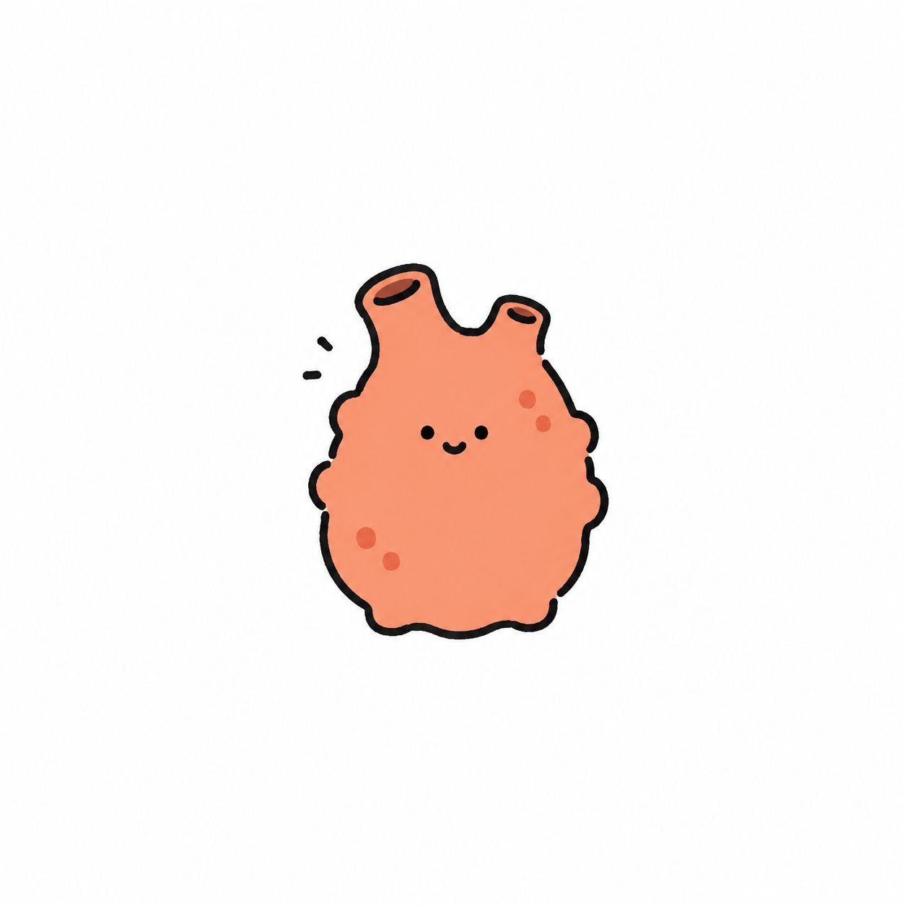

# 2026년 37주차(9월 2주차)

🎵 트리플에스 - Heavy Metal Wings\
https://www.youtube.com/watch?v=OEZQvCn0kFA

[[모소]]에서 [[주간정리]] 쓴다.

---

## [[kukui|레노버 크롬북 듀엣(CT-X636F)]]

또 재밌는 장비를 [[정한소비|샀다]]. 정말 [[거짓말]] 없이 5년은 [[고민]]했다. 사실 고민이라기 보다는, '갖고 싶다'고 생각만 하다가 이제야 샀다. 날 위한 [[퇴사]] [[선물]]이였다. 그런데 생각보다 훨씬 재밌어서 거의 [[일상생활]]이 불가능하다. 근데 이게 다 [[코딩 에이전트]]가 아니였다면 불가능 했을 것 같다. 내가 어떻게 [[libmali]] 스택을 [[postmarketOS|pmOS]]로 포팅하고, [[Gentoo]]의 emerge EAPI 7에 [[Flatpak]]을 포팅하고, [[Sommelier]]를 추출해서 [[AppImage]]에 동봉해서 [[Crostini]] 없이 [[리눅스]] 앱을 돌릴 수 있었을까. 정말로 이제 능력의 한계는 상상력뿐인 세상이 온 것 같다. 그리고 실제로 나는 이게 너무 재밌어서 잠을 늦게 자고 수면 패턴이 큰 일 났다(이따가 더 말할 얘기이기도 함).

## 어느 날 무언가 다가왔다

여러가지가 다가왔다. 첫 번째는 [[퇴사]]고, 두 번째는 가족의 입원이고, 세 번째는 [[이별]]이고, 네 번째는 [[개강]]이다. [[철권]]에서 콤보 스킬 쓰는 것도 아니고, 3일마다 크게 쳐맞았다. 괜찮아질 만 하면 또 손님이 오고, 이제 살 만 하면 손님이 오고. 이틀 정도는 뇌가 없는 [[멍게]]처럼 살았다. 근데 그래도 [[약]]이 참 신기하더라, 멍게에게 뇌를 [[재건]] 해놓고, 다시 움직이게 한다. 사람의 [[마음]]은 참 신기하더라. 신경 전달물질은 집어들 수 없을 만큼 극미량이고, 약은 [[바람]]에 사라질 만큼 작은데, 한 [[세상]]을 바꾼다.

[[Instinct]]가 그려준 멍게

근데 최근 깨달은거. 나 [[ADHD]] 아닐 수도 있을 것 같다. [[정신과]] 선생님께 내 고충을 토로하니 [[웰부트린]]을 추가로 처방 해주셨는데(현: [[콘서타|콘]] 27 + 웰 빨간거 1/4 + [[인데놀]] 20), 이걸 먹으니까.. 슈퍼인간이 된 것 같다. 밥 먹고 양치를 할 수 있고, 집 와서 바로 샤워를 할 수 있다. 방금은 [[세탁기]]가 끝나자 마자 빨래를 널었다(그래도 밥 먹고 나서 [[설거지]]를 할 정도는 아직 아니다). 사실 지금까지 의문이 컸다. 내가 ADHD라면 어떻게 [[수능]] 공부를 그렇게 열심히 했을까? 어떻게 [[초등학생]] 때는 모난 구석이 없는 [[우등생]]이였을까?

지금 [[기면]]과 [[주의력 장애]]를 겪고 있는 것은 맞지만, 어쩌면 그 이유가 내 신경 [[기질]]이 아니라 만성적인 [[우울]]일 수도 있을 것 같다. 이건 꼭 의사선생님께 말씀드려야지.

1년 전에 겪었던 우울(모두들 [[번아웃]] 조심하세요)과는 다른 부분이 있다고 느끼는데, 그 때는 막막함 / 스스로 미워함 / 신체이형장애 / 무가치함을 느꼈는데, 지금은 그 정도의 부정적인 생각은 안드는데, 그냥 생각이 없다. 좋아하던 일이 전 처럼 [[행복]]하게 느껴지지 않고, 안좋은게 있어도 크게 안좋게 느껴지지 않고([[고구마]] 안 씻고 삶았다고 전남친한테 혼남 아직도 억울한데 걍 그러려니 함), 해야 하는 일에 [[동기]]를 느끼지 못한다. 딱히 죽고 싶은 생각은 안 들고. 개강 이틀 차에는 '학교를 왜 가야 하지..'라는 생각마저 들었다. 약이 내 아픔을 말끔히 삭제시켜 준것 만은 아니다. 턱과 목 근육 과긴장, 약한 [[이인증]], [[어지럼증]](생각보다 심함), [[불면]]을 모두 겪고 있다.

사소한 일에서 동기가 줄어들거나 감정 폭이 작아진다면 정신과 강추합니다. 멘헤라토크 하실 분 연락주세요.

## [[스크린타임]](근데 할 일을 곁들인)

좋아하던 일이 전처럼 손이 가지 않다보니, 이상한 일에 손이 가고 그것만 하루 종일 붙잡고 있게 되었다. 외부 [[도구]]의 도움을 받기로 했는데, 우리 세계에는 스크린타임이라는 좋은 [[발명품]]이 있다. 그치만 난 스크린타임을 설정해두면 '5분 더 쓰기'를 영원히 누르거나 [[설정]]에서 해제해버릴 사람이다. 애초에 내가 [[기술]]에 관심을 갖게 된 것도 학습용 [[태블릿]] 단말기에서 [[유튜브]]를 보고 싶어서 닌자가 된 것. 나는 의미 없는 제한을 뚫는데에 선수라고 생각한다. 그랬으니 [[싸지방]]에서도 [[프로그래밍]]을 하지 않았겠는가.

그래서 스크린타임에 해제 조건을 붙혔다. 예를 들어, '[[자바]] 과제 제출하고 [[샤워]] 끝내면 [[휴대폰]] 쓸 수 있게 해줘'와 같은 식이다. 표현에서 알 수 있겠다시피, AI 에이전트가 내 폰 스크린타임의 해제 권한을 갖고, 내가 실제로 할 일을 완료했음을 검증했을 때에야 스크린타임을 풀어준다. 사실 오늘도 주간정리가 스크린타임 해제 조건에 걸려있어서 쓰고 있다. 에이전트는 [[Instinct]]에 물려놓았는데, [[오픈클로]]랑 뭐가 다른진 모르겠음. Hosted OpenClaw 느낌.

할 일이 해제 조건으로 이어지는게 참 좋다. 사실 대부분의 할 일들은 큰 [[보상]]이 없다. 내가 [[빨래]]를 아무리 열심히 널고 [[화장실 청소]]를 기깔나게 해도, 누구도 [[칭찬]]을 해주지 않으니.......(제 사고 회로는 그렇게 돌아가니까 이해하시길). 근데 스크린타임에 묶여있으면 [[Codex]]를 못쓰고, Codex를 못쓰면 레노버 크롬북 듀엣 해킹을 못해? 당장 할 일을 끝내야 할 수 밖에 없게 되는 것이다. 내가 좋아하는 것들을 모두 감옥에 넣어두면 할 일을 해낼 수 밖에 없게 되더라.

한번쯤은 본인의 가치 체계에 맞는 감옥을 만들어보세요. 좋은 것 같아요. 저는 새벽 두시까지 Codex 만지다가 '나 이거 좋아하는구나'라는 생각이 들어서 그걸 인질로 잡았음. 저 빨리 Flatpak 테스트 하러 가봐야 돼서 이만 줄일게요. 행복하십쇼.

---

2년만에 주간정리 쓰니까 생각보다 재밌다. 나는 글쓰기도 좋아하는 사람이였지.

딱 2년 전의 주간정리 보실래요?\
[[2024-w37|2024년 37주차 (9월 2주차)]]
