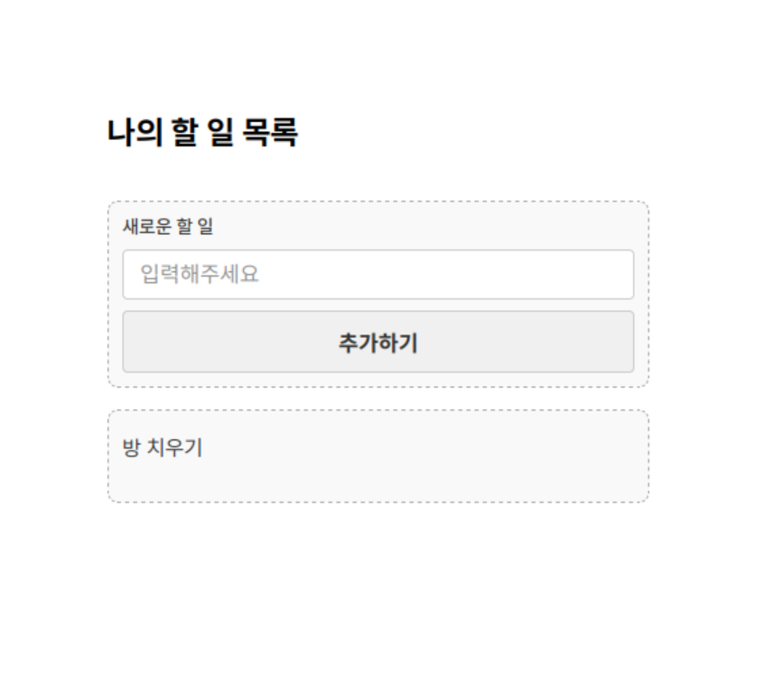

# [[달빛약속]]의 다섯 번째 [[대보름]] ([[달빛약속 v5]])

미뤄왔던 [[업데이트]]를 [[설날]] [[연휴]]동안 해치웠습니다. 예쁘게 봐주시면 감사하겠습니다. 새해 복 많이 받으세요.

> TL;DR:
> 1. [[클래스]] 지원 추가됨
> 2. [[표준 라이브러리]] 생김
> 3. [[자료형]]([[람다]], [[튜플]]) 추가됨
> 4. 앱 개발 [[PoC]]
> 5. [[오류]] 메시지 친절해짐

## 클래스

```
클래스, 계좌
    약속, __준비__ (소유자, 잔액)
        자신.소유자 = 소유자
        자신.잔액 = 잔액

    약속, (금액) 입금
        자신.잔액 = 자신.잔액 + 금액

    약속, (금액) 출금
        만약 자신.잔액 < 금액 이면
            "잔액부족" 반환하기
        자신.잔액 = 자신.잔액 - 금액
        "출금완료" 반환하기

클래스, 수수료계좌(계좌)
    수수료 = 2

    약속, (금액) 출금
        전체 = 금액 + 자신.수수료
        만약 자신.잔액 < 전체 이면
            "잔액부족" 반환하기
        자신.잔액 = 자신.잔액 - 전체
        "수수료출금완료" 반환하기
        
a = 새 수수료계좌("민수", 20)
a. 5 출금 보여주기
```

달빛약속은 고수준 [[프로그래밍 언어]]이기에 당연히 필요하다고 생각했습니다. 사실 클래스는 [[구현]]보다도 [[문법]]에 많은 고민이 있었습니다. `클래스`라는 [[영어]] 키워드를 사용하는게 맞을지, [[인스턴스]] 자기 자신을 향하는 [[식별자]]의 이름은 뭐라고 할지, 인스턴스 [[프로퍼티]]에 접근할 때는 점을 쓰는게 옳은지 등등..이였습니다. 그렇게 열심히 고민한 결과를 이제야 소개해드립니다. 고민을 이어갈 수록, [[파이썬]] 내지는 [[자바스크립트]]와 유사한 문법을 차용하는 것이 언어 [[사용자]]에게도 [[LLM]]에게도 제게도 좋은 방향이라는 생각이 들었습니다. 사실 위보다 좋은 방법이 달리 생각나지 않았던 것은 아닙니다. 실제 구현되진 않았지만 심각하게 고민했던 문법을 소개해드립니다.

```
묶음, 수수료 계좌(예금주, 잔액)
    금리 = 0.004
    약속, (금액) 출금하기
        ...

a = 새 수수료 계좌("민수", 20)
a: 10 출금하기
```

- 클래스 선언 키워드에서 `클래스` 대신 `묶음`을 사용하기(원본 [[파이썬 약속]]에서 고안됨.)
- 별도의 초기자 없이 class body에서 필드를 초기화하기([[Ruby]]와 동일한 방법)
- 메소드를 호출할 때 점(`.`)이 아니라 콜론 `:`을 사용하기

특히 콜론을 사용하는데는 더 매력적인 부분도 있었는데요, 마치 대본의 대사처럼 읽을 수 있기 때문에, 특별한 지식이 없이도 인스턴스가 [[메소드]]의 주체라고 자연스럽게 이해할 수 있었습니다. 콜론의 사용은 정말 끝까지 고민했는데, 추후 [[딕셔너리]] 읽기와 표준메소드 등을 고려했을 때, 점(`.`)으로 통일하는 것이 좋을 것 같다고 생각하여 폐기하였습니다.

아무튼 그렇게 [[숙원사업]] 하나를 해치웠습니다.

## 표준 라이브러리 (표준 메소드)

이제 달빛약속은 멍청이 언어가 아닙니다. 표준 라이브러리를 새롭게 도입하였습니다.

```
모음여부 = "aeiouAEIOU".안에 'A'가 있는지
```

자바스크립트에서 차용하였습니다. `자료형.메소드` [[컨벤션]]입니다. 구체적으로 다음과 같은 메소드를 제공합니다:

```
길이: LENGTH
합계 구하기: SUM
곱 구하기: PRODUCT
(구분자)로 자르기: SPLIT
(구분자)로 합치기: JOIN
키들 가져오기: KEYS
값들 가져오기: VALUES
(키)를/을 (기본값)으로/로 가져오기: GET
안에 (대상)이/가 있는지: INCLUDES
(판별함수)으로/로 거르기: FILTER
(변환함수)으로/로 map/변환하기: MAP
(찾을문자)를/을 (바꿀문자)로/으로 바꾸기: REPLACE
(패턴) 찾기: FIND
모두 (판별함수) 인지: EVERY
하나라도 (판별함수) 인지: SOME
정렬하기: SORT_DEFAULT
최댓값 찾기: MAX
최솟값 찾기: MIN
펼치기: FLATTEN
중복제거: UNIQUE
빈도 구하기: FREQUENCY
값 종류: TYPE
(항목) 추가하기: APPEND
(비교함수)로 정렬하기: SORT_WITH_FUNC
```

## [[자료형]] 추가

### [[람다]]

```
양수들 = [-2, -1, 0, 1, 2].(람다 숫자: 숫자 > 0)로 하나라도 확인하기
양수들 보여주기
```

파이썬에서 차용한 문법입니다. 현재는 동작을 파라미터로 넘길 때만 사용합니다.

### [[튜플]]과 구조 분해

파이썬에서 차용한 튜플 자료형이 추가되었고, 함수 인자에서 한 튜플에 담긴 값을 여러 변수에 한 번에 할당하는 구조 분해가 지원됩니다.

```
좌표 = (10, 20)

약속, (x, y) 합치기
    x + y 반환하기

(10, 20) 합치기 보여주기
```

## `@dalbit-yaksok/web`: 약속으로 앱을 만들 수 있을까요?



```
제목 "나의 할 일 목록" 그리기

입력상자 = 박스 그리기
할일입력 = 문자 입력칸 "새로운 할 일" 그리기
추가버튼 = 버튼 "추가하기" 그리기

입력상자에 할일입력 넣기
입력상자에 추가버튼 넣기

목록상자 = 박스 그리기

추가버튼.눌렀을 때
    할일내용 = 텍스트 할일입력.값 그리기
    목록상자에 할일내용 넣기
    할일입력 비우기
    
    할일내용.눌렀을 때
        할일내용 지우기
```

간단한 PoC를 진행해보았고, 생각보다 성공적이였습니다.

### 지원되는 기능

다양한 DOM 조작 기능을 제공합니다:

UI 요소 생성
- `제목 "내용" 그리기` - H1 제목 생성
- `문자 입력칸 "질문" 그리기` - 텍스트 입력 필드
- `숫자 입력칸 "질문" 그리기` - 숫자 입력 필드
- `버튼 "내용" 그리기` - 버튼 생성
- `텍스트 "내용" 그리기` - 텍스트 요소 생성
- `박스 그리기` - 컨테이너 div 생성

DOM 조작
- `(부모)에 (자식) 넣기` - 요소를 다른 요소 안에 추가
- `(개체)에 (내용) 보여주기` - 요소의 텍스트 변경
- `(개체) 비우기` - 입력 필드 값 지우기
- `(개체) 지우기` - 요소를 DOM에서 제거

이벤트 처리
- `(개체).눌렀을 때` - 클릭 이벤트 핸들러
- `(입력칸).값` - 입력 필드의 현재 값 접근

## 그 외에도..

1. 오류메시지 열심히 깎았습니다. 이제 전보다 조금 더 친절합니다
2. 디렉토리 구조 정리했습니다.
3. 오픈클로한테 많이 혼났습니다..
